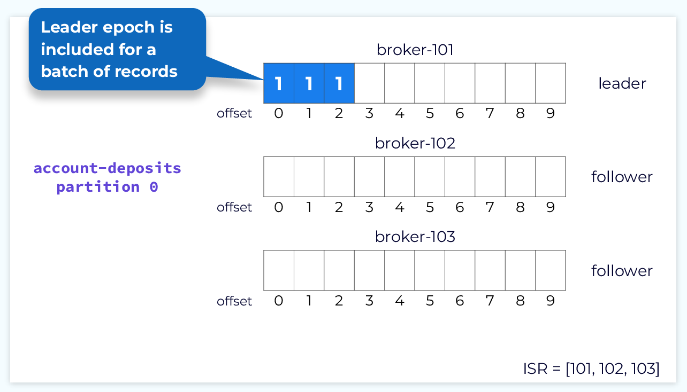

## 背景

### 数据存储层设计

​	从设计层面来看, 我们向 Kafka 写/读的数据存储在不同的 Topic 中. 每一个 Topic 能够被多个 消费者读取数据, 同时多个 生产者 也能够向其中写入数据. 作为分布式流处理平台, 实际应用中可能会出现长时间、大规模的读写请求, 如果 Topic 仅仅部署在单节点中是有可能在面对海量请求时崩溃而无法提供服务的. 为了保证可用性, Topic 会被划分多个 Partition, 这些 Partition 会被分布到不同的节点上. 此时 Topic 面对大规模的请求就会分发到不同 Partition 所在的节点. 但是同时也会产生新的问题: 假设我们希望读取 Topic 的中的数据( 假设它叫: data_read), 但是 data_read 所属 Partition 所在的节点不可用(网络出错、系统故障导致计算机重启中, 而在这个时候我们访问了它), 仍然会导致系统出错. 为了提高系统的容错能力, 我们需要对  Partition 进行复制从而得到多个 Replica, 当前提供服务的 Partition 节点如果出错的话, 就可以通过启用其他 Replica 来提供服务.

### Leader, Follower, In-Sync Replica (ISR) List

​	上面我们提到了, Topic 被划分为多个 Partition, 同时 Partition 也会被复制到多个 borker 上. 这么多的 replices 需要选择哪一个来提供服务呢? 实际上 replices 被划分了不同的角色, 对于每一个 Partition 中的 replices 有且一个会被称为 Leader 其余的则被称为 Follower. 实际的读写都是由 leader 来处理的, Follower 仅仅用于数据同步. 当 Leader 不可用时, 众多的 Follower 中的一个会被选择作为新的 Leader. 不断进行数据同步的 Leader 和 Follower 组成的集合称为:  In-Sync Replica (ISR) List. 不属于 ISR 的 Replica 被称为 observer.

## Replica 结构



​	每一个 Replica 有两个标识: 1. Offset 2. Epoch. Follower 同步时会通过 Offset 的差异来决定获取哪些数据. Epoch 标志每一个 Leader 的任期, 当 Leader 如果因为故障出错后, 新的 Leader 会被选举(出错时间足够长)并有一个不同的任期.  Epoch 主要作用是日志恢复.

## 数据同步

### Follower Fetch Request


​	每当新数据追加到 Leader 中时, 先写入到 本地的 log 中, 然后 ISR List 中的 Follower 会发生请求给 Leader 希望同步数据. 这个请求会携带 Follower 当前本身的 offset.

```json
//fetch request
{
	"offset": 0
}
```

### Follower Fetch Response


​	由于请求中携带了 follower 当前的 offset 位置, 我们只需要同步两者的差异.

```json
//fetch response
{
	records {
		{"offset": 0, "epoch": 1},
		{"offset": 1, "epoch": 1},
		{"offset": 2, "epoch": 1},
	}
}
```

### Committing Partition Offsets

​	当 ISR 中所有的 Follower 状态与 Leader 一致时(弱一致性, 每个 Follower 在 commit 后会向 Leader 发送携带当前 offset 的请求. 如果 Leader 收到足够多的响应后就会认为同步完成, 进而 Leader 移动 High water mark). 位于 High water mark 之前的 log 才能被消费.

​	同样的, 当 Leader 移动 HWM 后, 会向 Follower 分发请求, 同步 Follower 的 HWM.

