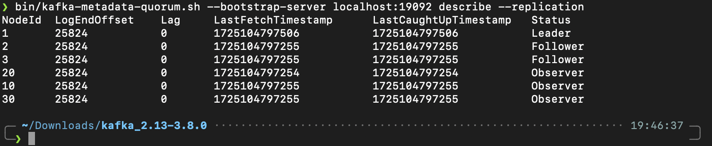
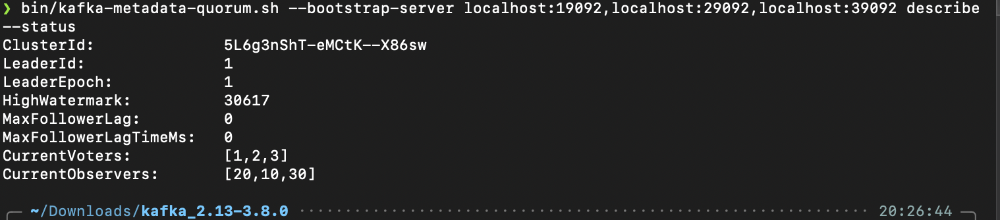
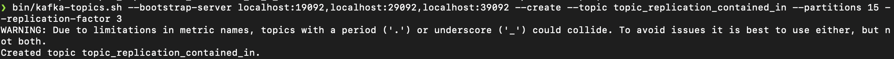
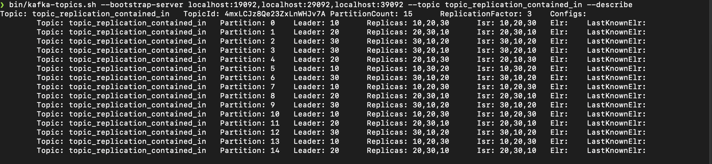

## Setup: 通过 Docker Compose 启动集群

docker-compose.yaml 文件中需要注意:

- 为了保证安全 **Controller** 是不允许被外部访问的, 外部服务只能访问集群中的 **broker**.
- **broker** 通过: `KAFKA_ADVERTISED_LISTENERS: PLAINTEXT://localhost:19092` 向外部提供服务.
- 宿主机访问集群, 端口映射导致宿主机通过 `localhost:19092` 访问到了 `PLAINTEXT://broker1:9092`

```yaml
version: '3.8'

services:
  controller1:
    image: apache/kafka:latest
    container_name: kafka_controller1
    hostname: controller1
    environment:
      KAFKA_PROCESS_ROLES: controller
      KAFKA_NODE_ID: 1
      KAFKA_CONTROLLER_QUORUM_VOTERS: "1@controller1:9093,2@controller2:9093,3@controller3:9093"
      KAFKA_CONTROLLER_LISTENER_NAMES: CONTROLLER
      KAFKA_LISTENERS: "CONTROLLER://controller1:9093"
      KAFKA_LOG_DIRS: /var/lib/kafka/data
      KAFKA_OFFSETS_TOPIC_REPLICATION_FACTOR: 3
      KAFKA_GROUP_INITIAL_REBALANCE_DELAY_MS: 0
    volumes:
      - ./controller1/data:/var/lib/kafka/data
    networks:
      - kafka_cluster

  controller2:
    image: apache/kafka:latest
    container_name: kafka_controller2
    hostname: controller2
    environment:
      KAFKA_PROCESS_ROLES: controller
      KAFKA_NODE_ID: 2
      KAFKA_CONTROLLER_QUORUM_VOTERS: "1@controller1:9093,2@controller2:9093,3@controller3:9093"
      KAFKA_CONTROLLER_LISTENER_NAMES: CONTROLLER
      KAFKA_LISTENERS: "CONTROLLER://controller2:9093"
      KAFKA_LOG_DIRS: /var/lib/kafka/data
      KAFKA_OFFSETS_TOPIC_REPLICATION_FACTOR: 3
      KAFKA_GROUP_INITIAL_REBALANCE_DELAY_MS: 0
    volumes:
      - ./controller2/data:/var/lib/kafka/data
    networks:
      - kafka_cluster

  controller3:
    image: apache/kafka:latest
    container_name: kafka_controller3
    hostname: controller3
    environment:
      KAFKA_PROCESS_ROLES: controller
      KAFKA_NODE_ID: 3
      KAFKA_CONTROLLER_QUORUM_VOTERS: "1@controller1:9093,2@controller2:9093,3@controller3:9093"
      KAFKA_CONTROLLER_LISTENER_NAMES: CONTROLLER
      KAFKA_LISTENERS: "CONTROLLER://controller3:9093"
      KAFKA_LOG_DIRS: /var/lib/kafka/data
      KAFKA_OFFSETS_TOPIC_REPLICATION_FACTOR: 3
      KAFKA_GROUP_INITIAL_REBALANCE_DELAY_MS: 0
    volumes:
      - ./controller3/data:/var/lib/kafka/data
    networks:
      - kafka_cluster

  broker1:
    image: apache/kafka:latest
    container_name: kafka_broker1
    hostname: broker1
    environment: 
      KAFKA_PROCESS_ROLES: broker
      KAFKA_NODE_ID: 10
      KAFKA_LISTENERS: "PLAINTEXT://broker1:9092"
      #宿主机通过端口映射来访问broker
      KAFKA_ADVERTISED_LISTENERS: PLAINTEXT://localhost:19092
      KAFKA_LISTENER_SECURITY_PROTOCOL_MAP: PLAINTEXT:PLAINTEXT,CONTROLLER:PLAINTEXT
      KAFKA_CONTROLLER_QUORUM_VOTERS: "1@controller1:9093,2@controller2:9093,3@controller3:9093"
      KAFKA_CONTROLLER_LISTENER_NAMES: CONTROLLER
    volumes:
        - ./broker1/data:/var/lib/kafka/data
    ports:
        - 19092:9092
    networks:
        - kafka_cluster

  broker2:
    image: apache/kafka:latest
    container_name: kafka_broker2
    hostname: broker2
    environment: 
      KAFKA_PROCESS_ROLES: broker
      KAFKA_NODE_ID: 20
      #宿主机通过端口映射来访问broker
      KAFKA_LISTENERS: "PLAINTEXT://broker2:9092"
      KAFKA_ADVERTISED_LISTENERS: PLAINTEXT://localhost:29092
      KAFKA_LISTENER_SECURITY_PROTOCOL_MAP: PLAINTEXT:PLAINTEXT,CONTROLLER:PLAINTEXT
      KAFKA_CONTROLLER_QUORUM_VOTERS: "1@controller1:9093,2@controller2:9093,3@controller3:9093"
      KAFKA_CONTROLLER_LISTENER_NAMES: CONTROLLER
    volumes:
        - ./broker2/data:/var/lib/kafka/data
    ports:
        - 29092:9092
    networks:
        - kafka_cluster

  broker3:
    image: apache/kafka:latest
    container_name: kafka_broker3
    hostname: broker3
    environment: 
      KAFKA_PROCESS_ROLES: broker
      KAFKA_NODE_ID: 30
      KAFKA_LISTENERS: "PLAINTEXT://broker3:9092"
      #宿主机通过端口映射来访问broker
      KAFKA_ADVERTISED_LISTENERS: PLAINTEXT://localhost:39092
      KAFKA_LISTENER_SECURITY_PROTOCOL_MAP: PLAINTEXT:PLAINTEXT,CONTROLLER:PLAINTEXT
      KAFKA_CONTROLLER_QUORUM_VOTERS: "1@controller1:9093,2@controller2:9093,3@controller3:9093"
      KAFKA_CONTROLLER_LISTENER_NAMES: CONTROLLER
    volumes:
        - ./broker3/data:/var/lib/kafka/data
    ports:
        - 39092:9092
    networks:
        - kafka_cluster

networks:
  kafka_cluster:
    driver: bridge

```

## 操作集群

### 下载本地客户端

因为集群部署在容器中, 因此在宿主机需要客户端来进行交互:

```sh
wget https://dlcdn.apache.org/kafka/3.8.0/kafka_2.13-3.8.0.tgz
tar -xzf kafka_2.13-3.8.0.tgz
cd kafka_2.13-3.8.0
```

### MetaData

#### Replication

```bash
bin/kafka-metadata-quorum.sh --bootstrap-server localhost:19092,localhost:29092,localhost:39092 describe --replication
```



通过 NodeId 在配置文件中进行定位可以得知:

- 对于 Controller 来说 controller1 此时为 Leader 状态(Active Controller), controller2、controller3 为 Follower 状态
- 对于 Broker 来说 broker1、broker2、broker3 此时为 Observer 状态

此处的 Leader 和 Follower 属于 Raft 算法中的概念, Leader、Follower 的角色总是动态平衡(保证集群中只有一个 Leader ). 而 Observer 是不会参与到 Leader 选举中的. 总而言之, Broker 永远都是 Observer 状态, Controller 总是在 Leader 和 Follower 之间切换. 

#### 状态

```bash
./kafka-metadata-quorum.sh --bootstrap-server localhost:19092,localhost:29092,localhost:39092 describe --status
```



- `LeaderId:1、LeaderEpoch:1` : controller1 还是 Leader, 且任期为 1(说明没有发生过选举).
- `HighWatermark:30617`: 与复制状态机有关, 表示状态机已应用日志的偏移量. (30617之前的日志中的操作已经被状态机同步).
- `CurrentVoters:[1,2,3]`: 集群中参与 Leader 选举的节点 Id(必须为 Controller).
- `currentObservers:[20,10,30]`: 集群中的 Broker, Topic 的 Replicates 与 Replication 保存在这里. 

### Topic 

#### 创建

```sh
bin/kafka-topics.sh --bootstrap-server localhost:19092,localhost:29092,localhost:39092 --create --topic topic_replication_contained_in --partitions 15 --replication-factor 3
```



- `--partitions 15`: Topic 是逻辑概念, 一个 Topic 中保存的数据可能分布在多个 Broker 中, 通过对 Topic 进行划分实现的. 这里我们将一个 Topic 分成 15 个 partition.

- `--replication-factor 3`: 由于 Topic 被划分成许多的 Partition , 当 Broker 宕机时, Topic 存放在此的数据便会丢失. 为了保证系统的可用: 复制这些 Partition 从而保证数据可以在其他 Broker 中找到. 在这里我们选择三个 Broker 对所有的 Partition 进行复制.(值得注意的是, 如果这里设置的 Broker 数量大于集群中的数量可能会出错).

##### 观察一下创建 Topic 的详情

```sh
bin/kafka-topics.sh --bootstrap-server localhost:19092,localhost:29092,localhost:39092 --topic topic_replication_contained_in --describe
```



可以清晰地看到 Topic 在集群中的情况:

- Leader: 以 broker1(`Leader: 10`)为例, 它是 Partition(0, 5, 7, 10 13) 的 Leader. 1. 客户端向这个 Topic 写入消息时, 会通过 Hash 映射来确定向哪一个 Broker 发送写请求(在这里是 broker1). 2. 这里的 Leader 属于数据层面管理的是普通消息, Controller 中的 Leader 属于控制层管理的是 MetaData.
- Replicas: 当前的 Partition 分布(备份/存在)在哪些 Broker.
- Isr: 是 **In-Sync Replicas** 的缩写, 用来维护 Broker 之间数据的一致性. 与 Controller 不同的是, ISR 是同步的, Kraft 是异步的. 